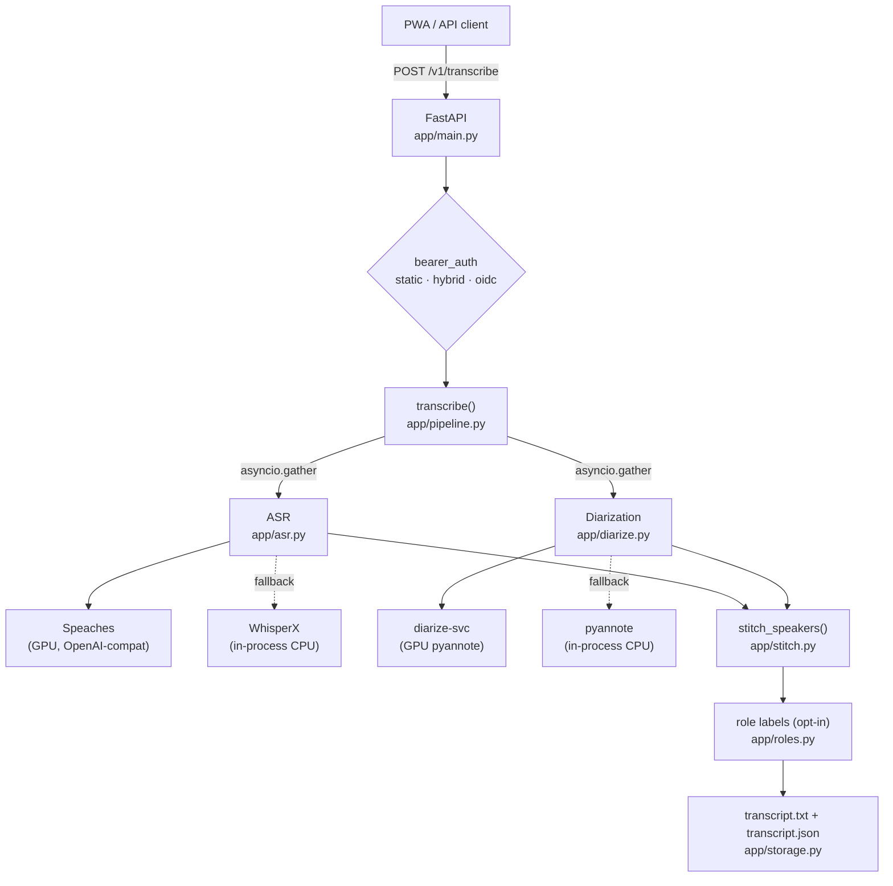

# transcribe-svc

**Self-hosted speaker-attributed transcription for conversations you own.**

Upload a recording, get back a speaker-labelled transcript. Everything runs on
your own hardware — the audio never leaves the machine you deploy it on.

[](https://github.com/wags878/transcriberproject/actions/workflows/ci.yml)
[](LICENSE)
[](https://www.python.org/downloads/)

---

> ### ⚠️ Read before you deploy this
>
> This project was built to record **patient↔provider conversations** — therapy
> sessions, doctor's appointments — so the patient keeps their own copy.
>
> - It is **not a medical device** and **not HIPAA-compliant**. It has been
>   audited and certified by nobody.
> - It is designed for a **trusted private network**, not the public internet.
>   It has no TLS of its own and no multi-tenancy: any caller with the token can
>   read every transcript on the instance.
> - **Recording another person may require their consent**, and the law varies
>   by jurisdiction. Know your local rules before you record anyone.
>
> [SECURITY.md](SECURITY.md) has the full threat model. Please read it.

---

## What it does

You hand it an audio file. It:

1. **Transcribes** the speech with Whisper (via [WhisperX][whisperx] locally, or
   an OpenAI-compatible GPU backend such as [Speaches][speaches]).
2. **Diarizes** the audio with [pyannote][pyannote] — *who* spoke *when* — on
   CPU in-process or offloaded to a GPU sidecar.
3. **Stitches** the two together, attaching a speaker to every transcript
   segment.
4. **Optionally names the speakers.** Enroll a voice once and the pipeline
   recognizes it in future recordings, labelling that person by name and the
   other party with a generic role.
5. **Writes** a human-readable `.txt` and a structured `.json` to disk.

ASR and diarization run **concurrently** (`asyncio.gather`), so the slower of the
two sets the pace rather than their sum.

There is also an installable **PWA web client** served from the same origin —
record straight from your phone's microphone, pick the audio language, optionally
translate to English, and rename or reassign speakers after the fact.

### Why this exists

Commercial transcription services want you to upload the most sensitive
conversation of your week to someone else's computer. This does the same job on
a box you control, and produces output clean enough to hand to an LLM for
downstream analysis.

## Highlights

| | |
|---|---|
| **Audio never leaves your host** | No third-party API calls in the transcription path. |
| **~10.9× realtime on a GPU** | A 60-minute recording finishes in about 6–7 minutes. See [Performance](#performance). |
| **Degrades, never fails** | Both GPU paths fall back to in-process CPU *per request*, so a GPU or sidecar outage costs you speed, not the job. |
| **Runs without a GPU** | The CPU profile is a single `docker compose up`. Slower, same output. |
| **Any format ffmpeg reads** | WAV, MP3, M4A/AAC, FLAC, OGG, Opus, WebM, and audio inside MP4/MOV/MKV. |
| **Three auth modes** | Shared bearer token, OIDC (verified against your provider's JWKS), or both during migration. |
| **Speaker naming, opt-in** | Voice enrollment is off by default and never leaves your volume. |
| **Installable PWA** | Mic capture, language selection, English translation, post-hoc speaker editing. |

## Quick start

The CPU profile needs nothing but Docker. Start here even if you have a GPU.

```bash
git clone https://github.com/wags878/transcriberproject.git
cd transcriberproject
cp .env.example .env
```

Generate an API token:

```bash
python3 -c "import secrets; print(secrets.token_urlsafe(32))"
```

Paste it into `.env` as `API_TOKEN`.

**You also need a HuggingFace token.** The diarization models are gated, so the
download fails without one. Accept the conditions for
[speaker-diarization-community-1](https://huggingface.co/pyannote/speaker-diarization-community-1),
create a token at [huggingface.co/settings/tokens](https://huggingface.co/settings/tokens),
and set it as `HF_TOKEN`.

Then bring the stack up:

```bash
docker compose up -d
```

Open <http://localhost:8000> for the web client and paste the token into
Settings. Or call the API directly:

```bash
TOKEN=$(grep ^API_TOKEN .env | cut -d= -f2-)
curl -H "Authorization: Bearer $TOKEN" \
     -F "audio=@samples/friendly_conversation.mp3" \
     -F "title=demo" \
     http://localhost:8000/v1/transcribe
```

You get back a job id and two URLs:

```json
{
  "id": "5b2f2e1b-9c92-4a7d-b9b6-c0d2eb6c0a52",
  "transcript_txt_url": "/v1/results/5b2f2e1b-.../transcript.txt",
  "transcript_json_url": "/v1/results/5b2f2e1b-.../transcript.json",
  "speakers_detected": 2,
  "duration_seconds": 1834.5,
  "language": "en",
  "task": "transcribe",
  "output_language": "en"
}
```

The first run downloads model weights (~3 GB), so give it a few minutes. Four
synthetic sample clips ship in [`samples/`](samples/) — no real audio is
included in this repository, and none should ever be committed to it.

### GPU stack

`docker-compose.gpu.yml` runs the full four-container stack: a Tailscale sidecar
that owns the network identity and terminates TLS, Speaches for GPU ASR, the
`diarize-svc` GPU diarization sidecar, and the service itself.

```bash
docker compose -f docker-compose.gpu.yml up -d --build
```

This needs additional `.env` values — `TS_AUTHKEY` for Tailscale, and `HF_TOKEN`
if you switch to a gated diarization model. The reference deployment is Windows
11 + WSL2 + Docker Desktop on an RTX 5090; [docs/DEPLOY.md](docs/DEPLOY.md) walks
through it, including the parts that are easy to get wrong.

## Architecture



The dotted edges are the fallback paths, and they are load-bearing: backend
selection happens **per request**, so if the GPU sidecar is unreachable the job
still completes on CPU. `ASR_BACKEND` / `ASR_HOSTS` select the speech-to-text
tier; `DIARIZE_BACKEND` / `DIARIZE_URL` select the diarization tier.

Offline ML tooling — the WER/DER evaluation harness and the voice-enrollment
sweep — lives under [`ml/`](ml/) and only ever talks to the service over HTTP.

## API

Every endpoint requires `Authorization: Bearer <token>` except `/v1/health` and
`/v1/auth/config`.

| Method | Path | Purpose |
|---|---|---|
| `POST` | `/v1/transcribe` | Upload audio; returns job id + result URLs |
| `GET` | `/v1/results/{id}/transcript.txt` | Human-readable transcript |
| `GET` | `/v1/results/{id}/transcript.json` | Structured segments + metadata |
| `POST` | `/v1/results/{id}/relabel` | Rename or reassign speakers |
| `GET` | `/v1/health` | Liveness + local device info *(public)* |
| `GET` | `/v1/auth/config` | Which auth mode is active *(public)* |
| `GET` | `/v1/auth/me` | The authenticated principal |
| `GET` | `/v1/admin/storage` | Disk usage by category |

`POST /v1/transcribe` accepts `audio` (required), plus optional `title`,
`num_speakers`, `language`, and `task` (`transcribe` or `translate`). Maximum
upload is 500 MB (`MAX_UPLOAD_MB`).

The JSON output carries the provenance of every run — `model`, `device`,
`diarization_model`, `diarize_device`, and `asr_backend` — so you can always tell
which tier actually served a request. **Check those fields rather than the
wall-clock** when you are diagnosing performance; a cold GPU model load looks a
lot like a CPU fallback and is not one.

Full contract, field by field: [docs/API.md](docs/API.md).

## Configuration

Everything is environment variables; [`.env.example`](.env.example) documents
each one inline. The settings you are most likely to touch:

| Variable | Default | What it does |
|---|---|---|
| `AUTH_MODE` | `static` | `static` · `hybrid` · `oidc` |
| `API_TOKEN` | — | Shared bearer token for `static`/`hybrid` |
| `WHISPER_MODEL` | `medium` | `tiny` … `large-v3` |
| `WHISPERX_DEVICE` | `cpu` | `cpu` or `cuda` |
| `ASR_BACKEND` | `whisperx` | `whisperx` (in-process) or `router` (try `ASR_HOSTS` in order) |
| `DIARIZE_BACKEND` | `local` | `local` (in-process CPU) or `remote` (GPU sidecar) |
| `DIARIZATION_MODEL` | `pyannote/speaker-diarization-community-1` | Both supported models are gated on HuggingFace |
| `HF_TOKEN` | — | Required — an account that accepted the model's conditions |
| `MAX_CONCURRENT_JOBS` | `1` | Hard cap on simultaneous jobs |
| `RETAIN_DAYS` | `30` | Retention sweep on container start; negative disables |
| `ENABLE_ROLE_LABELS` | `0` | Opt-in speaker naming via voice enrollment |

### Speaker naming (opt-in)

With `ENABLE_ROLE_LABELS=1`, the pipeline embeds each diarized speaker cluster,
compares it against enrolled voiceprints, and names any match — the other party
in a two-speaker session becomes `CLIENT_LABEL`. Enrollments are built offline:

```bash
docker compose -f docker-compose.gpu.yml run --rm -v ${PWD}/ml:/app/ml \
  transcribe-svc python -m ml.enroll.enroll --name Clinician --clip reference.wav
```

**Voice enrollments are biometric identifiers.** They are gitignored, they belong
on a private volume, and they should never be synced to shared or cloud storage.
Measured separation on real voices is 0.59–0.72 for genuine matches against 0.13
for an impostor, giving a default threshold of `0.5` — re-sweep it on your own
voices before trusting it ([`ml/enroll/reports/`](ml/enroll/reports/)).

## Performance

Measured on the reference GPU host (RTX 5090, Whisper `large-v3`, pyannote on
CUDA). Higher is better — these are *faster* than realtime:

| Audio | Wall clock | Realtime factor |
|---|---|---|
| 90.9 s | 8.3 s | **~10.9×** |
| 834 s | 96.2 s | **~8.7×** |
| 32.4 s (warm) | 3.1 s | **~10.3×** |
| 32.4 s (cold — model evicted) | 35.3 s | ~0.9× |

A 60-minute recording lands in roughly **6–7 minutes**. Longer clips show a
*lower* factor because diarization takes a proportionally bigger share.

**Measure warm, or you will misdiagnose the stack.** Speaches evicts its model
after five idle minutes; the first request afterward spends most of its time
reloading weights, which looks exactly like a CPU fallback. Send one throwaway
request first, and confirm the backend from the response header rather than the
clock.

On CPU-only hardware, expect roughly **2× slower than realtime** with `medium`
and AVX-512 available — a 60-minute recording in about 2 hours. Full run tables,
including concurrency and model-size comparisons:
[docs/HARDWARE.md](docs/HARDWARE.md).

## Development

You do **not** need a GPU, torch, or the 14 GB image to work on most of this
codebase. The test suite stubs the inference pipeline:

```bash
python3 -m venv .venv && source .venv/bin/activate
pip install -r requirements-dev.txt
pytest -q          # 85 tests, ~3 seconds
```

Python 3.11+ is required. To exercise the real inference stack instead:

```bash
docker compose run --rm transcribe-svc pytest tests/
```

See [CONTRIBUTING.md](CONTRIBUTING.md) before opening a pull request.

## Project layout

```
transcriberproject/
├── app/                    FastAPI service
│   ├── main.py             routes
│   ├── pipeline.py         orchestration (ASR ∥ diarization)
│   ├── asr.py              backend router + OpenAI-compat client
│   ├── diarize.py          local + remote diarizers
│   ├── stitch.py           joins speaker turns onto ASR segments
│   ├── roles.py / embed.py speaker naming via voice enrollment
│   ├── auth.py             static token + OIDC bridge
│   └── static/             installable PWA client
├── diarize-svc/            GPU diarization sidecar (FastAPI + pyannote)
├── docker/                 service image + entrypoint
├── ml/                     offline eval harness + voice enrollment
├── samples/                synthetic demo clips
├── tests/                  pytest suite
└── docs/                   see below
```

## Documentation

| Document | What's in it |
|---|---|
| [docs/API.md](docs/API.md) | Endpoint contract, field by field |
| [docs/DEPLOY.md](docs/DEPLOY.md) | Bring-up for both profiles, including Windows/WSL2 + GPU |
| [docs/AUTH.md](docs/AUTH.md) | OIDC bridge and the static → hybrid → oidc rollout |
| [docs/HARDWARE.md](docs/HARDWARE.md) | Host specs and every benchmark run |
| [docs/STATUS.md](docs/STATUS.md) | Phase-by-phase development log |
| [docs/BLOCKERS.md](docs/BLOCKERS.md) | Known issues and accepted limitations |
| [docs/HANDOFF.md](docs/HANDOFF.md) | Operator quick-reference for the reference deployment |
| [docs/superpowers/](docs/superpowers/) | Design specs and execution plans |

The operator-facing docs (`STATUS`, `HANDOFF`, `BLOCKERS`, `HARDWARE`) are a
candid engineering record rather than polished prose — kept because the
benchmark data and the reasoning behind each decision are the useful part. Host
identifiers in them have been replaced with placeholders. They also reference a
`PROJECT_PLAN.md` that lives in a separate private planning repository and is
not included here.

## Contributing

Contributions are welcome. Please read [CONTRIBUTING.md](CONTRIBUTING.md) — and
note the one rule that matters most: **never contribute real audio, real
transcripts, or real voice enrollments**, in a commit, an issue, or a bug report.

Security issues go through [private reporting](SECURITY.md), not public issues.

## License

[Apache License 2.0](LICENSE).

This project depends on third-party components under their own licenses — see
[NOTICE](NOTICE). Model weights are downloaded at runtime and are **not**
redistributed here; their licenses apply to you directly as the party
downloading them.

Two components are CC-BY-4.0 and **require attribution if you deploy this**:

> Speaker diarization powered by pyannoteAI's `speaker-diarization-community-1`
> model, licensed CC-BY-4.0.

> Speaker embeddings computed with `pyannote/wespeaker-voxceleb-resnet34-LM`,
> licensed CC-BY-4.0.

The second applies only when `ENABLE_ROLE_LABELS=1`. [NOTICE](NOTICE) carries the
full component list, the gating status of each model, and the citations the
pyannote authors request.

[whisperx]: https://github.com/m-bain/whisperX
[pyannote]: https://github.com/pyannote/pyannote-audio
[speaches]: https://github.com/speaches-ai/speaches
